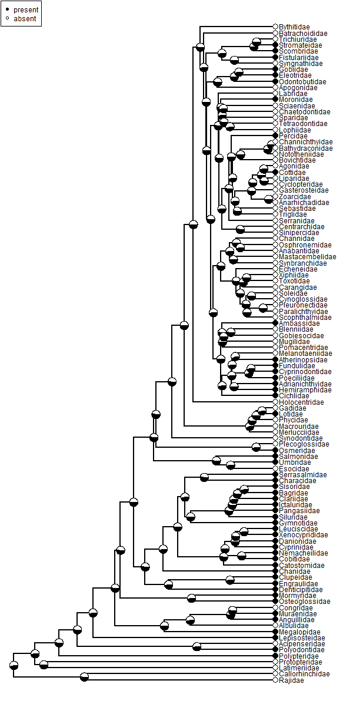
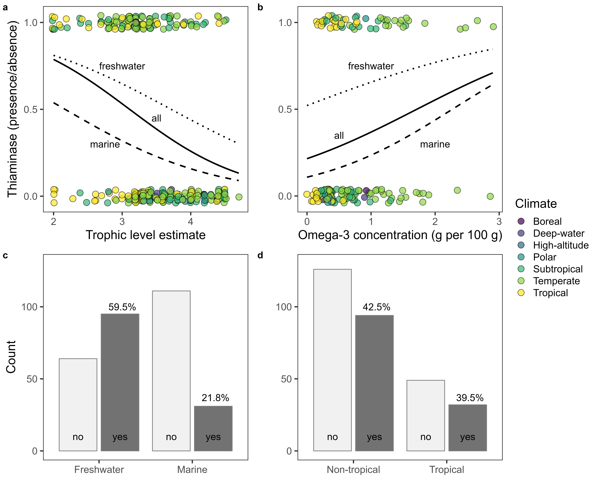

# Thiaminase

## Authors
- Freya Rowland
- Rachel A Munds
- Cathy Richter
- Don Tillitt
- David Walters

A repository for exploring the evolutionary and ecological factors driving thiaminase production in fishes

## Data files

- [AllData.csv](<data/AllData.csv>) includes all ecological fish data
- [fishorder_skeletal.tre](<data/fishorder_skeletal.tre>) is the evolutionary phylogeny from [Rabosky et al. 2018](<https://www.nature.com/articles/s41586-018-0273-1>) downloaded from <https://fishtreeoflife.org/>
- [BecanturTree.tre](<data/BecanturTree.tre>) is the tree I want to use for the phylogeny from [Betancur et al. 2017](<https://bmcecolevol.biomedcentral.com/articles/10.1186/s12862-017-0958-3>) who also has a GitHub repository https://github.com/projectdigest/betancur_r-fish-tree/
- [OrderPresAbs.csv](<data/OrderPresAbs.csv>) is a csv file with presence of absence of thiaminase within each fish order in the Rabosky phylogeny
- [OrderPresAbsNA.csv](<OrderPresAbsNA.csv>) includes NA for orders not present in our dataset but are in the Rabosky phylogeny
- [data/Orders.csv](<data/Orders.csv>) a clean up file for matching orders from <https://fishbase.de> to orders in Rabosky. Should delete.

## R Scripts

- [Models.R](<code/Models.R>) includes Bayesian models for predicting thiaminase based on ecological characteristics
- [PhylogenyCode.R](<code/PhylogenyCode.R>) has Freya's attempts at building a phylogeny and seeing if node distance can predict thiaminase presence/absence
- [Becantur2017Code.R](<code/Becantur2017Code.R>) is old code of Freya trying to figure out how to go from species level to order level in the phylogeny I want to use. Obsolete.
- [code/PruningBetancur.R](<code/PruningBetancur.R>) is the family-level code for pruning the Betancur data to family-level and plotting the character simulations at each node.

## Figures

Potential figures for publication.

### Family-level phylogeny. No evolutionary relationship between probability of thiaminase expression within a family.

### all significant plots

